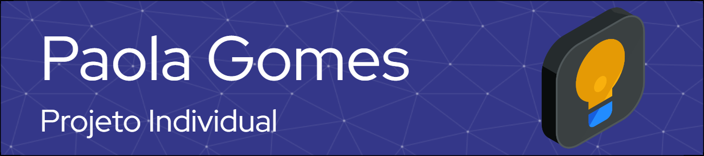

Este repositório contém o código-fonte de um Dashboard de Desempenho que oferece uma visão detalhada do uso da CPU e RAM em um ambiente específico. O projeto é construído usando HTML, CSS e JavaScript, com a integração de bibliotecas como Chart.js e SweetAlert.

## Introdução

O Dashboard de Desempenho fornece uma interface intuitiva para monitorar o desempenho médio da CPU e RAM, apresentando gráficos e indicadores-chave de desempenho (KPIs). Ele é projetado para oferecer uma compreensão clara do comportamento desses componentes essenciais em um ambiente de computação.

## Funcionalidades

- **Gráficos Dinâmicos:** Visualize o uso médio da CPU e RAM ao longo do tempo com gráficos interativos.
- **Indicadores-Chave de Desempenho (KPIs):** Obtenha métricas importantes, como desempenho da CPU, desempenho da RAM, total de máquinas, maior valor da CPU e maior valor da RAM.
- **Explicação Detalhada:** Compreenda melhor o desempenho da CPU e RAM por meio de uma explicação detalhada, incluindo conceitos fundamentais e uma tabela informativa.

## Pré-Requisitos

Antes de começar, certifique-se de ter os seguintes requisitos instalados:

- Navegador web moderno (recomendado: Google Chrome, Mozilla Firefox)
- Conexão à internet para carregar bibliotecas externas

## Tecnologias Utilizadas

<link rel="stylesheet" href="https://cdn.jsdelivr.net/gh/devicons/devicon@v2.15.1/devicon.min.css">
                               
      

## Instalação

1. Clone o repositório para sua máquina local:

   ```bash
   git clone https://github.com/Centrix-Solutions-Grupo-07/Projeto_Individual_Paola.git
   ```

2. Abra o arquivo `index.html` em um navegador web.

## Como Contribuir

Se deseja contribuir para este projeto, siga as etapas abaixo:

1. Faça um fork do repositório.
2. Crie uma branch para sua contribuição:

   ```bash
   git checkout -b feature/sua-contribuicao
   ```

3. Realize suas alterações e faça commit:

   ```bash
   git commit -m "Adiciona funcionalidade/sua-contribuicao"
   ```

4. Faça push para a branch:

   ```bash
   git push origin feature/sua-contribuicao
   ```

5. Abra um pull request na página do repositório.

## Licença

Este projeto é distribuído sob a [Licença MIT](LICENSE).

## Contatos:

<div>
<a href = "mailto:paola.gomes@sptech.school"></a>
<a href="https://www.linkedin.com/in/paola-gomes-/" target="_blank"></a>   
